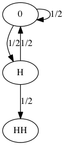
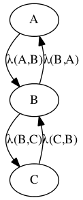
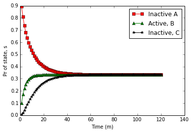

# Differential Equations in Data Science

The ordinary differential equation (ODE) is a tool often overlooked in data
science. It's not listed in [the top 10 data science algorithms](
http://www.cs.umd.edu/~samir/498/10Algorithms-08.pdf), Google's Chief
Economist's [tricks for big
data](http://people.ischool.berkeley.edu/~hal/Papers/2013/ml.pdf) or by the
numerious texts in data science. However, it's a tool that's been in use for
centuries, modeling everything from predicting [optimal pharmaceutical dosing
schedules](http://www.ncbi.nlm.nih.gov/pubmed/19854637) through [estimating
options pricing](http://en.wikipedia.org/wiki/Black%E2%80%93Scholes_model). Here
at URX we feel no tool should be left behind. We've re-surfaced the ODE and, as
a gentle introduction, would like to show how it relates to a very common data
science tool, markov chains.

## Discrete Time Markov Chains

A discrete time markov chain is a stochastic process modeling a sequence of
random variables within a system. The likelihood of the next random variable in
the sequence only depends on the current state.

Formally, given a sequence of events $X_0,X_1,... X_n$ the probability of
transitioning to state $i_n$ can be written as:

$$P\left\{X_n=i_n| X_0=i_0,...,X_{n-1}=i_{n-1}\right\} = P\left\{X_n=i_n |
X_{n-1}=i_{n-1} \right\}$$

Associated with a Markov Chain is the one-step probability transition matrix,
$A$ defined by:

$$a_{i,j}(n) = P\left\{X_{n+1}=j|X_n=i\right\}$$

Let's look at a common example (and an interview favorite!):

Q: What is the expected number of tosses of a fair coin to observe 2 heads in
row?

Solution: Let's formulate the problem as a markov chain. Any individual coin is
considered an independent event. As such, to observe two consecutive heads, we
only need knowledge of the previous state of the coin. If the previous toss was
heads, we only need one more to stop. If the previous toss was tails, we need to
start counting over. Diagram 1 below shows the basic idea

    from IPython.display import Image
    i = Image(filename='Coin_MC.png')
    i

To translate this Markov diagram into a set of equations we can solve, let's
define $X_i$ as the expected number of tosses to reach $HH$ from state $i$. The
first equation we can write is:

$$
X_0 = 1 + \frac{1}{2}X_H + \frac{1}{2}X_0
$$

Here, $X_H$ represents the expected number of tosses to observe $HH$ given that
we've observed zero consecutive heads. In this case we've either just started
the coin flip game or our last observation was a T. Looking at the Markov Chain
we use the definition of expected values, $\textbf{E}[Z]=Z*P(Z)$, and the law of
total probability we can write:

$$
\begin{split}
X_0 & = (\text{No matter the outcome, we need one more toss}) \\
    & + (\text{# Tosses remaining if } H\text{ is observed } |\ H \text{ is
observed}) * P(H \text{ is observed}) \\
    & + (\text{# Tosses remaining if } T \text{ is observed } |\ T \text{ is
observed}) * P(T \text{ is observed})
\end{split}
$$

$X_0 = 1 + (\textbf{E}[X_H])*(\frac{1}{2}) + (\textbf{E}[X_0])*(\frac{1}{2})$

$X_0 = 1 + \frac{1}{2}X_H + \frac{1}{2}X_0$

___________________

We can use similar reasoning to write a second equation:
$$
X_H = 1 + \frac{1}{2}X_0
$$

Combining the two yields the solution:

$$X_0 = 6 $$

Therefore the expected number of tosses to observe two consecutive heads is 6.
This problem can be similarly solved by setting up the above linear equations in
matrix form:

$$
\left( \begin{array}{cc}
1/2 & -1/2  \\
-1/2 & 1   \end{array} \right)
\left(\begin{array}{cc}
X_0 \\
X_H \end{array} \right) =
\left(\begin{array}{cc}
1 \\
1 \end{array} \right)
$$

The matrix solution is coded below in python

    import numpy as np
    
    A = np.array([[.5,-.5],[-.5,1]])
    b = np.array([1,1])
    X = np.linalg.solve(A,b)
    print 'Expected number of steps from state 0: '+str(X[0])

    Expected number of steps from state 0: 6.0

##Continuous Time Markov Chains
Discrete time Markov chains can be extended to a continuous time domain. The
probability of the next random variable in a continuous time Markov Chain (CTMC)
depends on both the previous random variable and the time elapsed since this
observation. Formally, we can write:

$$
P\{x(t)=j|F_{x(s)}\}=P\{x(t)=j|x(s)\}
$$

Where $F_{x(s)}$ is the sequence of all observed random variables, $x$ through
time $s$. This Markov property is analogous to the discrete-time formulation
above. Additionally, we introduce a new property of CTMCs, time heterogeneity:

$$
P\{x(t)=j|x(s)\}=P\{x(t-s)=j|x(0)\}
$$

Where the likelihood of transitioning states only depends on the relative length
of time considered rather than the absolute time. It can be shown that there is
only one continuous random variable satisfying both of the above conditions, the
exponential random variable:

$$
f(x)=
\begin{cases}
    \lambda e^{-\lambda x} & \text{if } x\geq 0\\
    0              & \text{otherwise}
\end{cases}
$$

It's simple to show the exponential random variable satisfies both the Markov
property and time heterogeneity:

$$
\begin{align*}
P(x>s+t|x>t) &= \frac{P(x>s+t,x>t)}{P(x>t)} \\
             &= \frac{P(x>s+t)}{P(x>t)} \\
             &= \frac{e^{-\lambda (s+t)}}{- \lambda t} \\
             &= e^{-\lambda s} \\
             &= P(x>s)
\end{align*}
$$

Let's take a look at an example. A new pharmaceutical reaction is under study.
We're asked to investigate the dynamics of how this novel drug is metabolized by
the human body. From pre-clinical observations, it's been discovered that the
drug can transition between three states: ${A, B, C}$. States $A$ and $C$ are
inactive (and not-harmful) whereas state $B$ is the desired active state. The
drug can transition between $A \Leftrightarrow B$
and $B \Leftrightarrow C$, but cannot directly
transition $A \Leftrightarrow C$. It's also been
observed that the rate at which the pharmaceutical transitions between states
mimics an exponential distribution. How long does this drug spend in the active
state?

As a first step let's visualize this problem as a continuous time Markov Chain:

    from IPython.display import Image
    i = Image(filename='ABC_MC.png')
    i

An embedded Markov Chain can be formulated:

$$
A=\left( \begin{array}{ccc}
0 & \lambda(A,B) & 0  \\
\lambda(B,A) & 0 & \lambda(B,C) \\
0 & \lambda(C,B) & 0
\end{array} \right)
$$

Let's simulate the states of this pharmaceutical using the [Gillespie
algorithm](http://www.ncsu.edu/crsc/reports/ftp/pdf/crsc-tr11-17.pdf).

    %matplotlib inline

    from __future__ import division
    import numpy as np
    
    # rates for leaving current state
    A = np.array([.1, .2, .1])                                     
    # number of Markov transitions to observe
    N = int(1e5)
    # state vector
    X = np.zeros(N+1)
    # time vector
    T = np.zeros(N+1)
    # 'probability' vector
    P = np.zeros(3)
    
    for n in range(N):
    
        # sample the next transition time from exp distribution                                   
        tnext = np.random.exponential() / A[X[n]]
        T[n+1] = T[n] + tnext
    
        # move to the next Markov state                                                           
        if X[n] == 0:
            X[n+1] = 1
        elif X[n] == 1:
            if np.random.rand() > .5:
                X[n+1] = 2
            else:
                X[n+1] = 0
        else:
            X[n+1] = 1;
    
    for i in range(3):
    
        # idxs of when Markov Chain transitioned to state i                                                        
        idx = np.where(X == i)[0];
        idx = idx[:-1];
    
        # 'Probabilities' (fraction of the time MC in state i)                                         
        P[i] = np.sum( (T[idx+1] - T[idx]) ) / (T[-1] - T[0]);
    
    print "Fraction of time observed by each state is: "
    print P

    Fraction of time observed by each state is: 
    [ 0.33356391  0.33332016  0.33311175]

Unsurprisingly, with equal transition rates for every reaction, the
pharmaceutical is equally likely to be in any state. The question remains, how
do we calculate the probability of observing a state at a specific time?

## A Primer on Differential Equations
Before we look at linking Markov chains with ordinary differential equations
(ODEs), let's get a quick overview of ODEs. As the name implies, differential
equations are formed as equations of the derivate of a function. They're common
constructs used in physics (Newton's law is a second-order ODE), chemistry and
biology where it's often easier to measure the derivate of a function (e.g.,
velocity) than the function itself (e.g., position).

The simplest form of a differential equation is simply a constant

$$
\frac{dx}{dt}=1
$$

To solve, multiply by dt and integrate:

$$
\begin{align*}
    dx &= dt \\
    x  &= \int dt \\
    x  &= t + C
\end{align*}
$$

Where $C$ is an arbitrary constant. Given an initial condition, say $x(0) = 1$
we can solve for $C$. In this case, $C= 1$

A slightly more complicated example:

$$
\begin{align*}
    \frac{dx}{dt} &=-x \\
    \frac{dx}{x} &= -dt \\
    \int \frac{dx}{x}  &= \int -dt \\
    ln(x)  &= -t + c \\
    x  &= e^{-t+c} \\
    x  &= Ce^{-t}
\end{align*}
$$

As with above, given an initial condition, $C$ can be quantified.

This solution form should look familiar to the continuous time Markov chain rate
constants above, an exponentially distributed variable. Let's go one step
further and extend to a system of ordinary differential equations. As a simple
example, let's solve a system of two differential equations

$$
\begin{align*}
    \frac{dx_1}{dt} &= -\lambda(1,2) x_1(t) + \lambda(2,1) x_2(t)\\
    \frac{dx_2}{dt} &= \lambda (1,2) x_1(t) - \lambda(2,1) x_2(t)
\end{align*}
$$

And reforming as a matrix system:

$$
\frac{dX}{dt} =\left(
    \begin{array}{cc} -\lambda(1,2) & \lambda(2,1) \\
    \lambda(1,2) & -\lambda(2,1) \\
    \end{array} \right) X
$$

Similar to the scalar case, we can write the solution to this linear ODE using a
matrix exponential $\textbf{e}$

$$
\textbf{X} = \textbf{X}_0*\textbf{e}^{\textbf{A}t}
$$

Where $\textbf{A}$ is the above $2X2$ coefficient matrix and $X_0$ is determined
by an initial condition. To solve this system, there are two approaches. The
first is direct evaluation of the matrix exponential, but this is often an
[inaccurate and laborious
process](http://www.cs.cornell.edu/cv/researchpdf/19ways+.pdf). Rather, we'll
use an adaptive [Runga-Kutta](http://en.wikipedia.org/wiki/Runge_kutta) method
to discretize, in time and approximate the differential $\frac{dX}{dt}$ as a
series of iterative steps.

First order linear systems of ODEs present with one of three possible solutions:

- exponential growth, where eigenvalues of the coefficient matrix are positive.
- exponential decay, where eigenvalues are negative.
- oscillatory behavior, where imaginary eigenvalues.

For a more in depth derivation and description of ordinary differential
equations, take a look at [Boyce, W., DiPrima R., *Elementary Differential Equat
ions*](http://courseware.ku.edu.tr/ahmetkoc/public_html/W.%20E.%20Boyce,%20R.C.%
20DiPrima%20-%20Elementary%20Differential%20Equations%20and%20Boundary%20Value%2
0Problems.pdf), and a detailed technical description of the numerics of solving
such differential equations can be found in [Eugene Isaacson's Analysis of
Numerical Method](http://books.google.com/books/about/Analysis_of_Numerical_Meth
ods.html?id=y77n2ySMJHUC)

## Linking MCs with ODEs
Let's revisit our previous question with continuous-time Markov Chains; what is
the probability of being in a state at a given time?

To solve this, we present the [*Kolmogorov Forward
Equation*](http://en.wikipedia.org/wiki/Kolmogorov_Forward_Equation)

$$
P'(t) = \textbf{A}P(t)
$$

Where $P(t)$ is a vector of probabilities for each state,
$P_{ij}=P\{x(t)=i|x(0)=j\}$ of transitioning to state $i$ from state $j$ within
a time period, $t$. A nice derivation of this equation can be found in [Bremaud,
P. Markov Chains: Gibbs Fields, Monte Carlo Simulation, and Queues](http://siste
mas.fciencias.unam.mx/~silo/Cursos/ProcesosEst22011-2/Bremaud.pdf).

Continuing our pharmaceutical example from before, let's answer the question
what is the probability of transitioning to a state at time $t$? We'll need one
further piece of information: the initial state of the system. We'll say at time
0, the pharmaceutical is observed in inactive state $A$

    from scipy.integrate import ode
    
    def A():
        '''
        Transition probability matrix
        '''
        return np.array([[-.1,.1,0], [.1,-.2,.1], [0,.1,-.1]])
    
    def dPdt(t,P,A):
        '''
        Differential equation: dP/dt = A * P
        '''
        return np.dot(P,A())
    
    def solveKFW(Tf):
        '''
        Discretize and integrate the Kolmogorov
        Forward Equation.
        '''
        
        #Define initial conditions
        P0 = np.array([1,0,0])
        t0 = 0
        dt = Tf/100
        
        #set the integrator
        rk45 = ode(dPdt).set_integrator('dopri45')
        rk45.set_initial_value(P0,t0).set_f_params(A)
        
        #integrate and store each solution in
        #a numpy matrix, P and T.
        P = np.zeros((100,3))
        T = np.zeros(100)
        P[0,:] = P0
        T[0]   = t0
        idx    = 0
        while rk45.successful() and rk45.t < Tf:
            rk45.integrate(rk45.t+dt)
            P[idx,:] = np.array(rk45.y)
            T[idx]   = rk45.t
            idx     += 1
        
        return P,T
        
    if __name__=='__main__':
        P,T = solveKFW(120)
        
        plot(T,P[:,0],'s-r')
        plot(T,P[:,1],'^-g')
        plot(T,P[:,2],'*-k')
        legend(['Inactive A','Active, B', 'Inactive, C'])
        xlabel('Time (m)')
        ylabel('Pr of state, s')

Thus, the probability of a given state quickly converges to $1/3$.

## Conclusion
So why use differential equations over Markov Chains?

In the end you can use both to answer different questions. Monte Carlo
simulations of continuous time Markov Chain hops approximates the number of
times a random variable observes a given state. This provides stochastically
approximated, local behavior of a MC. Integration of the Monte Carlo generator
(ordinary differential equation) provides a picture of the chain's transition
probabilities. This global behavior can help to understand the long-time
behavior of the chain.

Enjoy what you read? URX is hiring top notch data scientists, full stack
engineers and mobile engineers. Have a look at http://urx.com/careers or reach
out at [research@urx.com](mailto:research@urx.com). We'd love to hear how you
are making use of such techniques in your projects.
